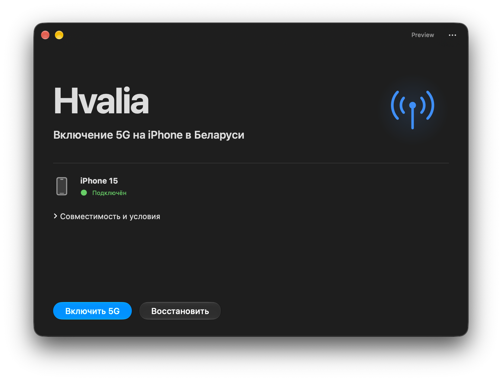
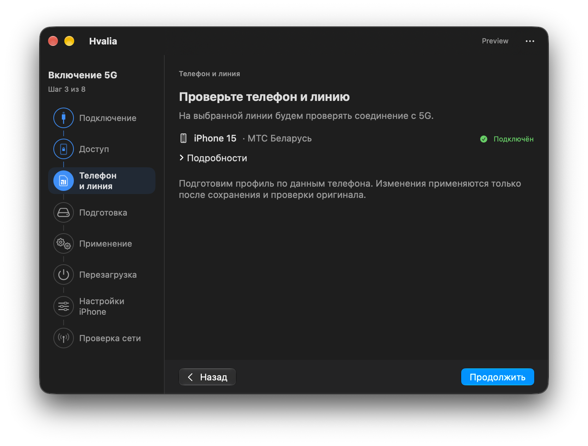

# Hvalia

**Включение 5G на iPhone в Беларуси**

Hvalia — приложение для macOS, которое включает пункты **«5G вкл.»** и **«5G автоматически»** в настройках iPhone, сохраняет исходный профиль и позволяет восстановить его. Подключение к 5G проверяется отдельно по данным модема.

[Скачать Preview](https://github.com/h1royuki/Hvalia/releases) · [Восстановление настроек](docs/RECOVERY.md) · [Сообщить о проблеме](https://github.com/h1royuki/Hvalia/issues)





## Требования и совместимость

- **Mac с Apple Silicon и macOS 14 Sonoma или новее.** Операции с телефоном проверены на macOS 27.0; на macOS 14/15/26 ещё не проверены.
- **iPhone с поддержкой 5G**, USB-кабель и доверие к Mac.
- Белорусская SIM/eSIM, подключённая услуга 5G и покрытие оператора.

| Оператор | Результат проверки |
| --- | --- |
| **МТС Беларусь** | На iPhone 15 с iOS 27.0 проверено включение настроек и подтверждено активное соединение с 5G. На iOS 26.6.2 проверены применение и восстановление настроек; соединение с 5G не подтверждено. |
| **life** | Ещё не проверен на реальном устройстве и сети. |

**Для МТС Беларусь нужна подключённая услуга «Интернет 5G».** Hvalia не подключает услуги оператора и не добавляет покрытие.

Приложение распространяется как **Preview**. Проверки не гарантируют работу на других моделях и версиях iOS. Условия и способы проведённых проверок — в [совместимости](docs/COMPATIBILITY.md) и [журнале проверок](docs/VALIDATION.md).

## Установка и использование

1. Скачайте архив из [Releases](https://github.com/h1royuki/Hvalia/releases), распакуйте и откройте `Hvalia.app`.
2. Подключите и разблокируйте iPhone. Если потребуется, подтвердите доверие на Mac и телефоне.
3. Нажмите **«Включить 5G»** и следуйте инструкциям. Не отключайте кабель во время операции.
4. Перезагрузите iPhone и выберите **«5G вкл.»** в разделе **Настройки → Сотовая связь → нужная линия → Голос и данные**.
5. Запустите проверку сети. Её можно повторить из меню приложения без повторного изменения настроек.

Сборка подписана ad-hoc и не нотариализована Apple. macOS может заблокировать её открытие. Приложение также можно собрать из исходников по инструкции ниже.

Доступны русский, беларуский и английский языки: **«… → Язык»**.

## Восстановление

Нажмите **«Восстановить»**, подключите тот же iPhone и выберите сохранённый оригинал. Приложение проверит копию, восстановит исходные настройки и попросит перезагрузить телефон.

Перед изменением профиля Hvalia сохраняет две проверенные копии на Mac. Это копии затрагиваемых файлов, а не полная резервная копия iPhone. При извлечении оригинал сначала перемещается на телефоне: отключение кабеля на этом этапе может потребовать восстановления.

При незавершённой операции приложение открывает восстановление. Сохраните копии и следуйте [инструкции](docs/RECOVERY.md).

## Как это работает

Hvalia изменяет три параметра общего профиля Беларуси: `Show5GSwitch`, `Enable5GAutoByDefault` и `Enable5GByDefault`. Изменение может затронуть обе белорусские линии. Операторские пакеты и APN не меняются.

Наличие пунктов меню или значка 5G не подтверждает соединение: для этого используются данные модема. Подробности — в [архитектуре проекта](docs/ARCHITECTURE.md).

## Сборка из исходников

Нужны Apple Command Line Tools со Swift 6.3, SDK macOS 26+ и Git:

```sh
git clone https://github.com/h1royuki/Hvalia.git
cd Hvalia
./scripts/check.sh
./scripts/build-app.sh
open dist/Hvalia.app
```

Приложение и архив появятся в `dist/`. Проверки используют искусственные данные и не изменяют подключённый телефон.

[Участие в разработке](CONTRIBUTING.md) · [Происхождение компонентов](docs/PROVENANCE.md)

## Сообщить о проблеме

Создайте [issue](https://github.com/h1royuki/Hvalia/issues) с версией Hvalia, моделью iPhone, версией iOS, оператором и описанием ошибки. Не прикладывайте резервные копии и необработанные журналы: они могут содержать идентификаторы телефона и SIM. Об уязвимостях — [SECURITY.md](SECURITY.md).

## Лицензия

[MIT](LICENSE). Код, адаптированный из AirLift, сохраняет [уведомление об авторских правах](Native/LICENSE.airlift). Hvalia — независимый проект, не связанный с Apple или операторами связи.
